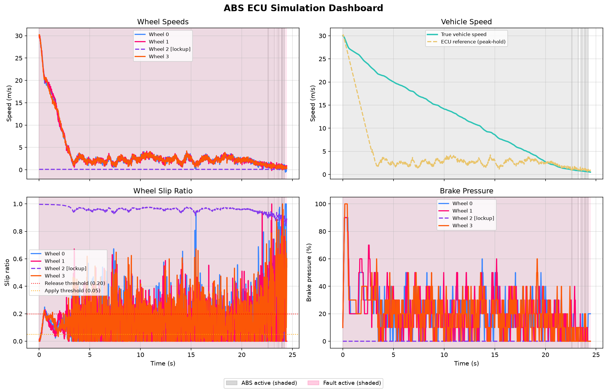

# ABS ECU FaultGuard

A realistic, modular, C++17 simulation of an Anti-lock Braking System (ABS) Electronic Control Unit (ECU) for automotive embedded systems. The project demonstrates a closed-loop control system with sensor input, ABS logic, actuator output, and fault injection, running in a 20 ms real-time loop.

---

## Overview

This project simulates an ABS ECU that:

- Monitors four independent wheel speed sensors
- Estimates vehicle speed using a peak-hold / deceleration-limited reference estimator
- Calculates per-wheel slip ratios
- Modulates brake pressure to prevent wheel lock (APPLY / HOLD / RELEASE)
- Injects configurable sensor faults at runtime to test ECU fault response

Design principles:

- Modular OOP architecture (sensor → fault injector → control → actuator)
- Real-time loop: 20 ms cycle using `std::chrono` and `std::thread`
- Slip-ratio-based control: APPLY / HOLD / RELEASE
- Simplified physics (wheel + vehicle plant model)
- Gaussian sensor noise
- CSV logging (full post-fault state)

---

## Features

- Four independent wheel sensors with individual Gaussian noise
- Peak-hold, deceleration-limited vehicle speed estimator (robust against simultaneous multi-wheel lockup)
- Slip calculation: `(V_ref - V_wheel) / V_ref`
- ABS control logic with three-state pressure modulation
- Pressure ramping (+-10% per cycle)
- Physics update (wheel and vehicle plant model)
- Real-time console output every cycle
- CSV logging — W0-W3 log the **post-fault sensor reading** used by the controller
- Configurable constants (`constexpr`)
- **Fault injection** — 3 fault types (bias, lockup, disconnected), configured via CLI flags
- **2x2 visualization dashboard** — wheel speeds, vehicle speed vs. ECU reference, slip ratios, and brake pressures (with fault regions shaded)

---

## Building

### Using g++
```bash
g++ main.cpp src/*.cpp -Iinclude -std=c++17 -O2 -Wall -o abs_ecu_sim
./abs_ecu_sim
```

### Using CMake
```bash
cmake -B build -DCMAKE_BUILD_TYPE=Release
cmake --build build
./build/abs_ecu_sim
# Run unit tests:
cd build && ctest --output-on-failure
```

---

## Running

- Starts at 30 m/s (~108 km/h)
- Generates `logs/abs_log.csv`
- Run `python scripts/analyze_log.py` after simulation to produce the dashboard

---

## Fault Injection

Inject sensor faults via one or more `--fault` flags on the command line:

```
./abs_ecu_sim --fault wheel=N type=TYPE [bias=V]
```

| Type | Description | Extra parameter |
| -------------- | --------------------------------------------- | ---------------------- |
| `bias` | Adds a fixed offset to every reading (m/s) | `bias=V` (required) |
| `lockup` | Forces wheel reading near zero (~0.1 m/s) | — |
| `disconnected` | Forces wheel reading to exactly 0.0 m/s | — |

**Examples:**

```bash
# Wheel 2 appears locked up (seized caliper simulation):
./abs_ecu_sim --fault wheel=2 type=lockup

# Wheel 0 reads 5 m/s too high (electromagnetic interference):
./abs_ecu_sim --fault wheel=0 type=bias bias=5.0

# Wheel 3 sensor wire is open-circuit:
./abs_ecu_sim --fault wheel=3 type=disconnected

# Multiple simultaneous faults:
./abs_ecu_sim --fault wheel=0 type=lockup --fault wheel=1 type=bias bias=-3.0
```

The ECU is completely unaware of whether a reading is faulted — it operates on the (possibly corrupted) value exactly as it would in a real embedded system.

---

## CSV Log (`logs/abs_log.csv`)

| Column | Description |
| ----------------------- | ------------------------------------------------------------------- |
| `Time(s)` | Simulation time (seconds) |
| `Veh_Speed` | True vehicle speed (m/s) |
| `Est_Veh_Speed` | ECU peak-hold reference speed estimate (m/s) |
| `W0_Speed`...`W3_Speed` | **Post-fault sensor reading** used by the controller (m/s) — reflects bias/lockup/disconnected effects |
| `P0`...`P3` | Brake pressure per wheel (%, 0-100) |
| `S0`...`S3` | Per-wheel ABS active flag (1 = this wheel is currently releasing pressure) |
| `F0`...`F3` | Fault type index per wheel (0=none, 1=bias, 2=lockup, 3=disconnected) |
| `ABS_Active` | Overall ABS flag (1 = at least one wheel releasing pressure) |

**Example row (wheel 0 lockup fault active):**

```csv
Time(s),Veh_Speed,Est_Veh_Speed,W0_Speed,W1_Speed,W2_Speed,W3_Speed,P0,P1,P2,P3,S0,S1,S2,S3,F0,F1,F2,F3,ABS_Active
0.020,29.984,29.982,0.100,29.950,29.950,29.950,10.000,20.000,20.000,20.000,1,0,0,0,2,0,0,0,1
```

---

## Console Output

```text
t = 0.20 s | Vehicle: 29.84 m/s | Ref: 29.90 m/s
  Wheel 0: 0.10 m/s | 10.00% | RELEASE [FAULT:lockup]
  Wheel 1: 29.85 m/s | 30.00% | APPLY
  Wheel 2: 29.83 m/s | 30.00% | APPLY
  Wheel 3: 29.86 m/s | 30.00% | APPLY
------------------------------
```

---

## Architecture

- **BrakeActuator** — hydraulic actuator with `BrakeState` (APPLY/HOLD/RELEASE) and pressure ramping
- **WheelSpeedSensor** — wheel speed sensor with Gaussian noise
- **FaultInjector** — sits between the raw sensor and the ECU; applies per-wheel fault transforms
- **Vehicle** — updates vehicle speed based on average brake pressure (plant model)
- **ABSController** — manages sensors/actuators, runs peak-hold estimator, calculates slip, commands brakes, logs CSV
- **main()** — real-time loop: CLI fault parsing -> ECU control cycle -> physics update -> console output

---

## Simulation Parameters (`constexpr`)

| Constant | Description |
| --------------------- | ------------------------------------------------------------ |
| `DT` | Control cycle (s), default 0.020 |
| `INITIAL_SPEED` | Start speed (m/s), default 30.0 |
| `SLIP_THRESHOLD` | Slip above which ABS releases pressure, default 0.20 |
| `LOW_SLIP_THRESHOLD` | Slip below which ABS reapplies pressure, default 0.05 |
| `MAX_PRESSURE` | Max brake pressure (%), default 100.0 |
| `MAX_WHEEL_DECEL` | Max wheel deceleration (m/s^2), default 25.0 |
| `RECOVERY_RATE` | Wheel recovery rate when brake released (m/s^2), default 15.0 |
| `MAX_VEH_DECEL` | Max vehicle deceleration (m/s^2), default 8.0 |
| `MAX_REF_DECEL` | Max rate at which ECU reference speed may decrease (m/s^2), default 9.0 |

---

## Simulation Results

2x2 dashboard (vehicle speed, wheel speeds, slip ratios, brake pressures):



---

## Future Enhancements

- Advanced ABS algorithms (PID, adaptive slip)
- Enhanced physics (load transfer, per-wheel friction coefficient)
- CAN bus simulation
- HIL testing
- Multi-threaded sensor/control/logging threads

---

## Repository

[https://github.com/Sukanyaghosh17/abs-ecu-faultguard](https://github.com/Sukanyaghosh17/abs-ecu-faultguard)
